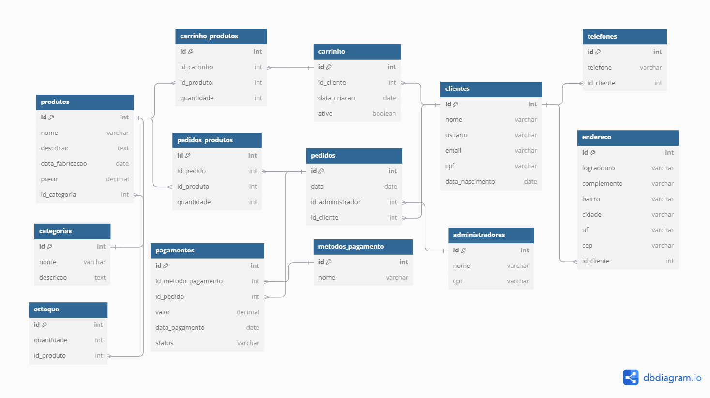

# Projeto de Banco de Dados 🛒

  

Este repositório contém o projeto desenvolvido para a disciplina **Banco de Dados** (ARA0040/Turma 3001), sob a orientação do professor **Célio Roberto da Silva Ramos de Souza** na **Universidade Wydern – UniRuy**, turno noturno. O objetivo do trabalho é demonstrar os conhecimentos adquiridos em sala de aula por meio da criação de um banco de dados.

## Objetivo do Projeto 🎯

A aplicação desenvolvida atende às seguintes especificações:

- Criação de um sistema de gestão de um e-commerce.
- Apresentação do diagrama do banco de dados.

## Entrega do Trabalho 📦

O trabalho deverá ser entregue por meio de um repositório Git, cujo link deverá ser enviado ao professor via Microsoft Teams.

## Ferramentas Utilizadas 🛠️

*As ferramentas utilizadas para a realização deste projeto foram:*

- **Microsoft SQL Server**: Para o gerenciamento e desenvolvimento do banco de dados.

## Integrantes do Grupo 👥

- **Wallace De Jesus Santana** - [Repositório](https://github.com/wallacemt/projeto-de-banco-de-dados-ecommerce)
- Nome do Integrante 2
- Nome do Integrante 3
- Nome do Integrante 4
- Nome do Integrante 5

